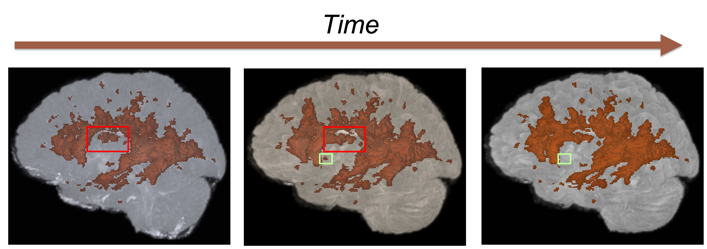

# Welcome to LongiSeg!


## What is LongiSeg?
LongiSeg is an extension of the popular [nnU-Net framework](https://github.com/MIC-DKFZ/nnUNet), designed specifically for **longitudinal medical image segmentation**. By incorporating temporal information across multiple timepoints, LongiSeg enhances segmentation accuracy and consistency, making it a robust tool for analyzing medical imaging over time.

LongiSeg includes several methods for temporal feature merging, including the newly introduced [Difference Weighting Block](https://github.com/MIC-DKFZ/Longitudinal-Difference-Weighting). &nbsp; &nbsp;   [](https://arxiv.org/abs/2409.13416) \
For more details on the underlying nnU-Net framework, visit the [nnU-Net repository](https://github.com/MIC-DKFZ/nnUNet).

Please cite the following works when using LongiSeg in your research:  

```bibtex
@article{rokuss2024longitudinal,
  title={Longitudinal segmentation of MS lesions via temporal Difference Weighting},
  author={Rokuss, Maximilian and Kirchhoff, Yannick and Roy, Saikat and Kovacs, Balint and Ulrich, Constantin and Wald, Tassilo and Zenk, Maximilian and Denner, Stefan and Isensee, Fabian and Vollmuth, Philipp and Kleesiek, Jens and Maier-Hein, Klaus},
  journal={arXiv preprint arXiv:2409.13416},
  year={2024}
}
@article{isensee2021nnu,
  title={nnU-Net: a self-configuring method for deep learning-based biomedical image segmentation},
  author={Isensee, Fabian and Jaeger, Paul F and Kohl, Simon AA and Petersen, Jens and Maier-Hein, Klaus H},
  journal={Nature methods},
  volume={18},
  number={2},
  pages={203--211},
  year={2021},
  publisher={Nature Publishing Group}
}
```

## Getting started
LongiSeg is easy to use and follows the basic principles of the nnU-Net framework.

In order to get started, we recommend to create a virtual environment with **at least** Python 3.10, e.g. using conda

```bash
conda create -n longiseg python=3.12
```

LongiSeg is not yet available via pip, therefore you need to clone the repository and install it locally. This will also allow for easy customization of the code.

```bash
conda activate longiseg
git clone https://github.com/MIC-DKFZ/LongiSeg.git
cd LongiSeg
pip install -e .
```

Finally, you need to set the paths for raw data, preprocessed data and results
```bash
export LongiSeg_raw="/path_to_data_dir/LongiSeg_raw"
export LongiSeg_preprocessed="/path_to_data_dir/LongiSeg_preprocessed"
export LongiSeg_results="/path_to_experiments_dir/LongiSeg_results"
```

If these are not set, LongiSeg will fall back to the respective nnU-Net paths, ensuring compatability with nnU-Net setups.

For more details on installation requirements and dataset structure, refer to the [nnU-Net installation](documentation/installation_instructions.md) and the [path setup](documentation/setting_up_paths.md) documentation.

## Using LongiSeg
Detailed usage instructions for LongiSeg can be found in the [documentation](documentation/how_to_use_longiseg.md).



TL;DR:
1. Prepare your [dataset](documentation/how_to_use_longiseg.md#dataset-format), ensuring it includes a `patientsTr.json` file.
2. Run [experiment planning and preprocessing](documentation/how_to_use_longiseg.md#experiment-planning-and-preprocessing): `LongiSeg_plan_and_preprocess -d DATASET_ID`.
3. [Train](documentation/how_to_use_longiseg.md#training) your model: `LongiSeg_train DATASET_NAME_OR_ID UNET_CONFIGURATION FOLD`
4. Run [inference](documentation/how_to_use_longiseg.md#inference) on unseen data: `LongiSeg_predict -i INPUT_FOLDER -o OUTPUT_FOLDER -path /path/to/patients.json -d DATASET_ID`
5. Run [evaluation](documentation/how_to_use_longiseg.md#evaluation) on the predicted segmentation: `LongiSeg_evaluate_folder GT_FOLDER PRED_FOLDER -djfile /path/to/dataset.json -pfile /path/to/plans.json -patfile /path/to/patients.json`

## Compatibility with nnU-Net
LongiSeg is fully compatible with nnU-Net and can be installed alongside it in the same environment. This allows users to seamlessly reuse existing nnU-Net structures, datasets, and preprocessing pipelines without modification.

## 🔗 Also check out: LesionLocator – Zero-Shot Tumor Tracking & Segmentation

If you're working on **lesion or tumor segmentation and tracking**, make sure to also check out our **LesionLocator** framework, introduced at **CVPR 2025**:

[](https://arxiv.org/abs/2502.20985)

🎯 **LesionLocator** is a powerful **zero-shot framework** for segmentation and longitudinal tracking of lesions in 3D whole-body imaging — no lesion-specific training required. It supports **prompt-based segmentation** (e.g., 3D point or box prompts) and **autoregressive tracking** across timepoints.

👉 GitHub: [https://github.com/MIC-DKFZ/LesionLocator](https://github.com/MIC-DKFZ/LesionLocator)  

LesionLocator and LongiSeg share a focus on **longitudinal analysis**, but with different strengths:
- **LongiSeg** is ideal for fully supervised, dataset-specific training with temporal modeling across timepoints.
- **LesionLocator** excels at **zero-shot generalization** and supports interactive & promptable workflows out of the box.

Use them **together** to benchmark traditional vs. zero-shot approaches — or combine insights from both for even better longitudinal segmentation performance.

# Acknowledgements


LongiSeg is developed and maintained by the [Division of Medical Image Computing](https://www.dkfz.de/en/mic/index.php) at the 
[German Cancer Research Center (DKFZ)](https://www.dkfz.de/en/index.html), supported by the Helmholtz Association under the joint research school “HIDSS4Health – Helmholtz Information and Data Science School for Health.

nnU-Net is developed and maintained by the Applied Computer Vision Lab (ACVL) of [Helmholtz Imaging](http://helmholtz-imaging.de) 
and the [Division of Medical Image Computing](https://www.dkfz.de/en/mic/index.php) at the 
[German Cancer Research Center (DKFZ)](https://www.dkfz.de/en/index.html).