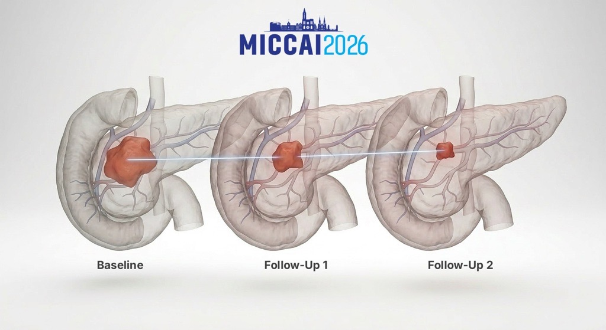
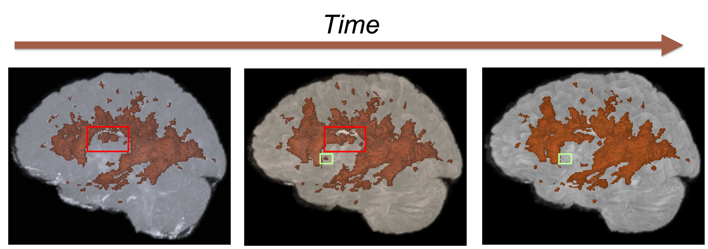

# Welcome to LongiSeg!

<div align="center">

[](https://arxiv.org/abs/2605.23118)&#160;
[](https://arxiv.org/abs/2409.13416)&#160;
[](https://github.com/MIC-DKFZ/LongiSeg)&#160;
[](https://huggingface.co/ykirchhoff/LongiTrack)&#160;
[](https://huggingface.co/datasets/mrokuss/PanTrack)&#160;
[](https://github.com/MIC-DKFZ/LongiTrack-napari)&#160;
[](LICENSE)&#160;
[](https://www.python.org/)

</div>


**LongiSeg** is the longitudinal extension of [nnU-Net](https://github.com/MIC-DKFZ/nnUNet): one framework for segmentation across timepoints, housing our work on **temporal feature merging** (MICCAI 2024) and on **clinician-verified interactive lesion tracking** (MICCAI 2026, oral).

---

## 📰 News

- **09/2026**: 🖥️ **LongiTrack is out!** The trained model, an inference backend and an interactive **napari plugin** bring the whole verified tracking workflow into the viewer 👉 [Try it yourself](#-try-it-yourself-longitrack-in-napari)
- **09/2026**: 🎤 Our tracking paper is an **Oral at MICCAI 2026** and nominated for the **Best Paper Award** and the **Young Scientist Award**. Find us at **Oral Session O4B** and **Poster Session 4**, we will also show a live demo!
- **09/2026**: 🥇 First place in the **MICCAI autoPET IV challenge**
- **06/2026**: 📄 *Exploiting Longitudinal Context in Clinician-Verified Interactive Lesion Tracking* was **early accepted at MICCAI 2026** (top 9%), together with the release of the **PanTrack** benchmark 👉 [PanTrack](#-pantrack-a-public-benchmark-for-pancreatic-lesion-tracking)
- **10/2024**: 📄 *Longitudinal segmentation of MS lesions via temporal Difference Weighting* was presented at **MICCAI 2024**, and LongiSeg was released

---

## 🎯 LongiTrack: clinician-verified lesion tracking

LongiSeg 2.0 introduces **Verified Tracking**, a clinically safe paradigm for lesion follow-up that separates lesion retrieval from delineation instead of silently accepting fully automatic tracking results:

1. A registration-based method proposes the corresponding lesion location in the follow-up scan.
2. A clinician verifies or corrects the proposed point prompt.
3. LongiSeg segments the lesion using the verified prompt and the baseline lesion appearance as longitudinal context.


The model combines **early prompt fusion**, **latent temporal difference weighting** and **large-scale synthetic longitudinal pretraining**, so that it can draw on both the current scan and the prior lesion appearance when segmenting a lesion across timepoints. It sets a new state of the art in lesion tracking, and even its automatic tracking outperforms the verified tracking results of competing methods.

👉 To train and run the tracking models yourself, see the [lesion tracking documentation](documentation/lesion_tracking.md).

### 🚀 Try it yourself: LongiTrack in napari

Longitudinal lesion tracking should not be a black box, so we release the whole workflow, not just the paper:

| | |
| --- | --- |
| 🧠 **Model** | The trained LongiTrack checkpoint on [🤗 Hugging Face](https://huggingface.co/ykirchhoff/LongiTrack), downloaded automatically on first use |
| 🖥️ **[LongiTrack-napari](https://github.com/MIC-DKFZ/LongiTrack-napari)** | An interactive [napari](https://napari.org) plugin: click a lesion in the baseline scan, verify or drag the propagated point, and get the lesion segmented in both scans |
| ⚙️ **[LongiTrack-backend](https://github.com/MIC-DKFZ/LongiTrack-backend)** | A standalone GPU service for model loading, registration and segmentation. It has no GUI of its own, so you can just as well build a viewer of your own against it |

The backend runs locally or on a remote GPU server, which means you can drive **remote sessions from a Linux, macOS or even Windows laptop, from anywhere in the world** while the model work happens on the server.

### 🥞 PanTrack: a public benchmark for pancreatic lesion tracking

[](https://huggingface.co/datasets/mrokuss/PanTrack)



Together with LongiSeg 2.0 we release **PanTrack**, the first public longitudinal benchmark for pancreatic cancer lesion tracking, with **45 patients** and **161 CT scans** with temporally matched annotations of pancreatic tumors and selected liver metastases.

👉 Download it from [🤗 Hugging Face](https://huggingface.co/datasets/mrokuss/PanTrack). The layout of the tracking annotations is described in the [dataset format section](documentation/lesion_tracking.md#dataset-format).

# Back to the roots: What is LongiSeg?
LongiSeg is an extension of the popular [nnU-Net framework](https://github.com/MIC-DKFZ/nnUNet), designed specifically for **longitudinal medical image segmentation**. By incorporating temporal information across multiple timepoints, LongiSeg enhances segmentation accuracy and consistency, making it a robust tool for analyzing medical imaging over time.

LongiSeg includes several methods for temporal feature merging, including the newly introduced [Difference Weighting Block](https://github.com/MIC-DKFZ/Longitudinal-Difference-Weighting). &nbsp; &nbsp;   [](https://arxiv.org/abs/2409.13416) \
For more details on the underlying nnU-Net framework, visit the [nnU-Net repository](https://github.com/MIC-DKFZ/nnUNet).

LongiSeg is the common framework behind our longitudinal segmentation work, and both papers can be trained and run from this repository:

| Paper | Venue | What it adds to LongiSeg |
| --- | --- | --- |
| [Longitudinal segmentation of MS lesions via temporal Difference Weighting](https://arxiv.org/abs/2409.13416) | MICCAI 2024 | temporal feature merging across timepoints, including the Difference Weighting Block |
| [Exploiting Longitudinal Context in Clinician-Verified Interactive Lesion Tracking](https://arxiv.org/abs/2605.23118) | MICCAI 2026 (Oral) | verified lesion tracking, prompt fusion, synthetic longitudinal pretraining, PanTrack |

## 📄 Citation
Please cite the following works when using LongiSeg in your research:  

```bibtex
@article{kirchhoff2026exploiting,
  title={Exploiting Longitudinal Context in Clinician-Verified Interactive Lesion Tracking},
  author={Kirchhoff, Yannick and Rokuss, Maximilian and Mertens, Daniel Philipp and F{\"u}ller, David and Hamm, Benjamin and Schreyer, Andreas and Ritter, Oliver and Maier-Hein, Klaus},
  journal={arXiv preprint arXiv:2605.23118},
  year={2026}
}
@inproceedings{rokuss2024longitudinal,
  title={Longitudinal segmentation of MS lesions via temporal Difference Weighting},
  author={Rokuss, Maximilian R and Kirchhoff, Yannick and Roy, Saikat and Kovacs, Balint and Ulrich, Constantin and Wald, Tassilo and Zenk, Maximilian and Denner, Stefan and Isensee, Fabian and Vollmuth, Philipp and Kleesiek, Jens and Maier-Hein, Klaus},
  booktitle={International Conference on Medical Image Computing and Computer-Assisted Intervention},
  pages={64--74},
  year={2024},
  organization={Springer}
}
```

## Getting started
LongiSeg is easy to use and follows the basic principles of the nnU-Net framework.

In order to get started, we recommend to create a virtual environment with **at least** Python 3.10, e.g. using conda

```bash
conda create -n longiseg python=3.12
```

LongiSeg is not yet available via pip, therefore you need to clone the repository and install it locally. This will also allow for easy customization of the code.

```bash
conda activate longiseg
git clone https://github.com/MIC-DKFZ/LongiSeg.git
cd LongiSeg
pip install -e .
```

Finally, you need to set the paths for raw data, preprocessed data and results
```bash
export LongiSeg_raw="/path_to_data_dir/LongiSeg_raw"
export LongiSeg_preprocessed="/path_to_data_dir/LongiSeg_preprocessed"
export LongiSeg_results="/path_to_experiments_dir/LongiSeg_results"
```

If these are not set, LongiSeg will fall back to the respective nnU-Net paths, ensuring compatability with nnU-Net setups.

For more details on installation requirements and dataset structure, refer to the [nnU-Net installation](documentation/installation_instructions.md) and the [path setup](documentation/setting_up_paths.md) documentation.

## Using LongiSeg
Detailed usage instructions for LongiSeg can be found in the [documentation](documentation/how_to_use_longiseg.md).



TL;DR:
1. Prepare your [dataset](documentation/how_to_use_longiseg.md#dataset-format), ensuring it includes a `patientsTr.json` file.
2. Run [experiment planning and preprocessing](documentation/how_to_use_longiseg.md#experiment-planning-and-preprocessing): `LongiSeg_plan_and_preprocess -d DATASET_ID`.
3. [Train](documentation/how_to_use_longiseg.md#training) your model: `LongiSeg_train DATASET_NAME_OR_ID UNET_CONFIGURATION FOLD`
4. Run [inference](documentation/how_to_use_longiseg.md#inference) on unseen data: `LongiSeg_predict -i INPUT_FOLDER -o OUTPUT_FOLDER -path /path/to/patients.json -d DATASET_ID`
5. Run [evaluation](documentation/how_to_use_longiseg.md#evaluation) on the predicted segmentation: `LongiSeg_evaluate_folder GT_FOLDER PRED_FOLDER -djfile /path/to/dataset.json -pfile /path/to/plans.json -patfile /path/to/patients.json`

For **verified lesion tracking** (LongiSeg 2.0), follow the [lesion tracking documentation](documentation/lesion_tracking.md) instead, which uses its own dataset format, preprocessor and trainers.

## Compatibility with nnU-Net
LongiSeg is fully compatible with nnU-Net and can be installed alongside it in the same environment. This allows users to seamlessly reuse existing nnU-Net structures, datasets, and preprocessing pipelines without modification.

## 🗺️ Roadmap
- [x] Longitudinal segmentation with temporal feature merging (MICCAI 2024)
- [x] Clinician-verified interactive lesion tracking (MICCAI 2026)
- [x] PanTrack benchmark release
- [x] **Viewer for interactive lesion tracking**: the [LongiTrack napari plugin](https://github.com/MIC-DKFZ/LongiTrack-napari) and its [backend](https://github.com/MIC-DKFZ/LongiTrack-backend)
- [ ] Front ends for other viewers (MITK, 3D Slicer) against the same backend 👀

Something missing? Open an [issue](https://github.com/MIC-DKFZ/LongiSeg/issues) and let us know.

## Also check out: LesionLocator – Zero-Shot Tumor Tracking & Segmentation

If you're working on **lesion or tumor segmentation and tracking**, make sure to also check out our **LesionLocator** framework, introduced at **CVPR 2025**:

[](https://arxiv.org/abs/2502.20985)

🎯 **LesionLocator** is a powerful **zero-shot framework** for segmentation and longitudinal tracking of lesions in 3D whole-body imaging — no lesion-specific training required. It supports **prompt-based segmentation** (e.g., 3D point or box prompts) and **autoregressive tracking** across timepoints.

👉 GitHub: [https://github.com/MIC-DKFZ/LesionLocator](https://github.com/MIC-DKFZ/LesionLocator)  

LesionLocator and LongiSeg share a focus on **longitudinal analysis**, but with different strengths:
- **LongiSeg** is ideal for fully supervised, dataset-specific training with temporal modeling across timepoints.
- **LesionLocator** excels at **zero-shot generalization** and supports interactive & promptable workflows out of the box.

Use them **together** to benchmark traditional vs. zero-shot approaches — or combine insights from both for even better longitudinal segmentation performance.

## 📬 Contact
For questions, issues, or collaborations, feel free to open an [issue](https://github.com/MIC-DKFZ/LongiSeg/issues) or contact:

📧 yannick.kirchhoff@dkfz-heidelberg.de / maximilian.rokuss@dkfz-heidelberg.de

## License
LongiSeg is released under the [Apache License 2.0](LICENSE), the same license as the [nnU-Net](https://github.com/MIC-DKFZ/nnUNet) framework it is built on. Parts of this repository are derived from nnU-Net and keep their original copyright headers. The **PanTrack** dataset is distributed separately under the license stated on its [Hugging Face dataset card](https://huggingface.co/datasets/mrokuss/PanTrack).

# Acknowledgements


LongiSeg is developed and maintained by the [Division of Medical Image Computing](https://www.dkfz.de/en/mic/index.php) at the 
[German Cancer Research Center (DKFZ)](https://www.dkfz.de/en/index.html), supported by the Helmholtz Association under the joint research school “HIDSS4Health – Helmholtz Information and Data Science School for Health.

nnU-Net is developed and maintained by the Applied Computer Vision Lab (ACVL) of [Helmholtz Imaging](http://helmholtz-imaging.de) 
and the [Division of Medical Image Computing](https://www.dkfz.de/en/mic/index.php) at the 
[German Cancer Research Center (DKFZ)](https://www.dkfz.de/en/index.html).
